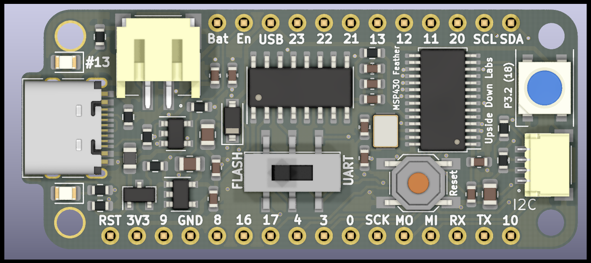
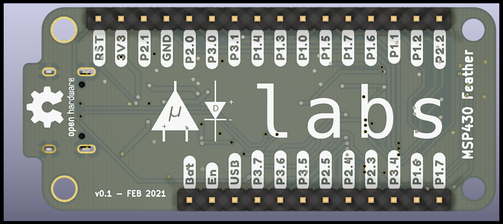
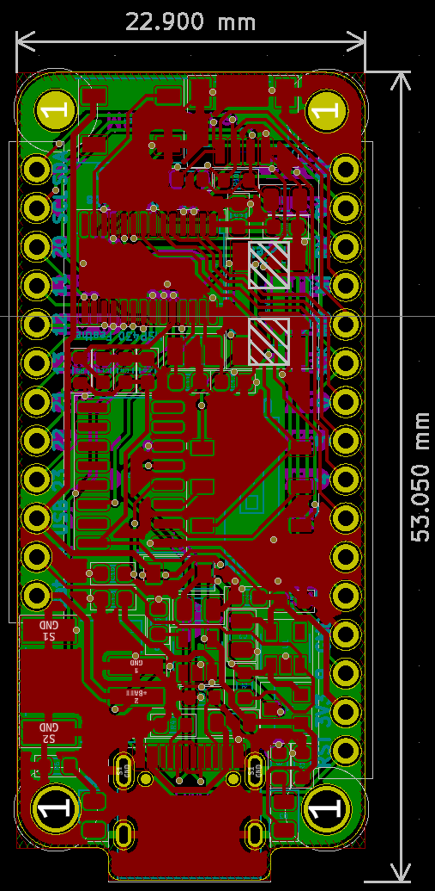
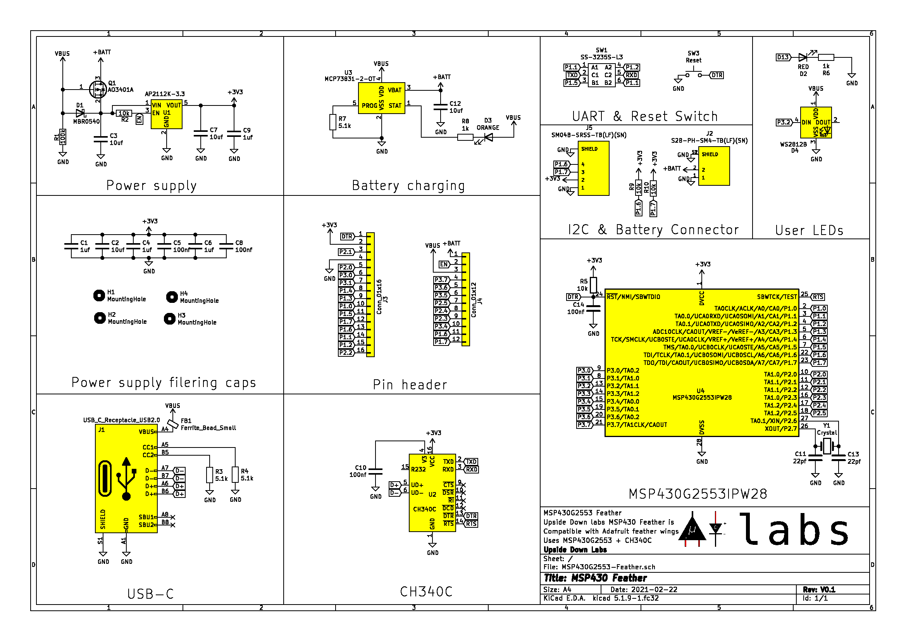

# MSP430G2553 Feather Board

  

MSP430G2553 based Adafruit feather compatible board 🪶

| Front              |  Back |
| :-------------------------: | :-------------------------: |
|   |  |

<!-- |Pinout|
| :--: |
|| -->

| Dimensions              |  Schematic |
| :-------------------------: | :-------------------------: |
| 53.05 x 22.90 mm  |  |

## License

#### Hardware
CERN Open Hardware License Version 2 - Strongly Reciprocal ([CERN-OHL-S-2.0](https://spdx.org/licenses/CERN-OHL-S-2.0.html)).

#### Software
MIT open source [license](http://opensource.org/licenses/MIT).

#### Documentation:
 This work is licensed under a <a rel="license" href="http://creativecommons.org/licenses/by/4.0/">Creative Commons Attribution 4.0 International License</a>.